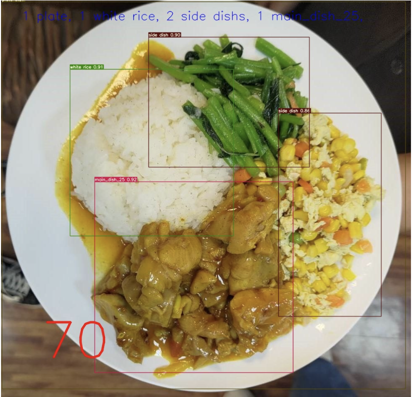

# Jinzhan-Cafeteria-AI
## Introduction
This project is the final project of the course, "Introduction to Machine Learning", in National Tsinghua University.
We modify YOLOv7 to detect the food image from the cafeteria in our campus, "Jinzhan", and also use regression model to predict the price based on the detection result from YOLOv7 model, since the price is not only based on number of each food classes but also its combination and food amount.

credit: https://github.com/WongKinYiu/yolov7
## Performance
With only regression and ±5 accuracy : 86.6%

With concatenated model and ±5 accuracy : 80.2%
## Dataset
There are two kinds of data:
### Image:
It contains both raw image and .txt file of label data. There are total 52 classes, we added a python script which can reduce class number to 9.

The decreased list is: ['plate', 'box', 'white rice', 'brown rice', 'purple rice', 'side dish', 'main_dish_25', 'main_dish_30', 'main_dish_40']

The Image dataset is packaged by Roboflow with Yolov7 format.
### Price
It contains ground truth price of each image. There is a column called fair price which is culculated only depends on number of each class and price of each class.

## Model
### Yolov7
The weight is Jinzhan.pt.
### Regression
It is in Model-> Regression.
## Modification
The main modification is that we added our regression model and also pluged it into detect.py. 
## How to use
``` shell
python detect.py --weights Jinzhan.pt --conf 0.25 --img-size 640 --source 0
```
## Food estimation
<div align="center">
    <a href="./">
        
    </a>
</div>
## Use of right
This is open to anyone who is interested.
